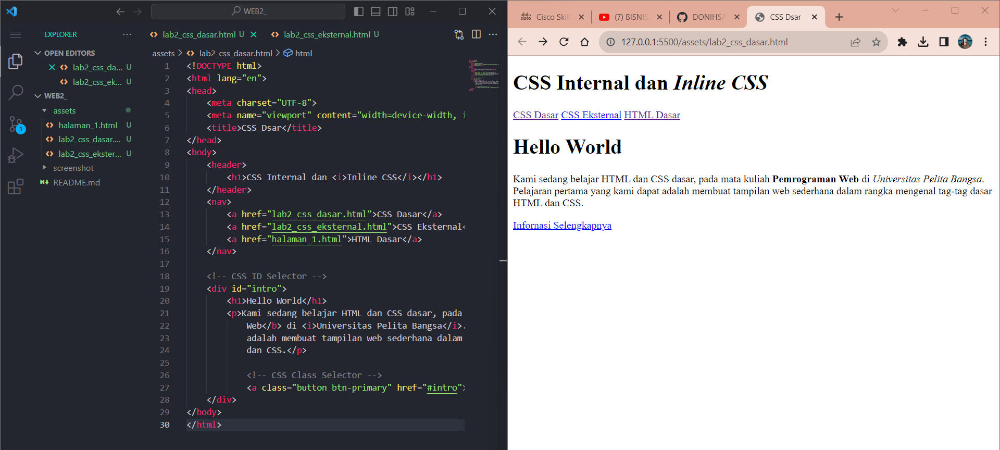
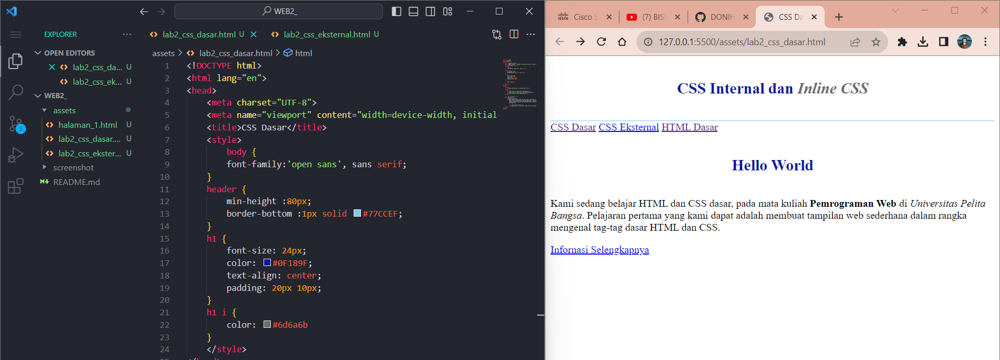
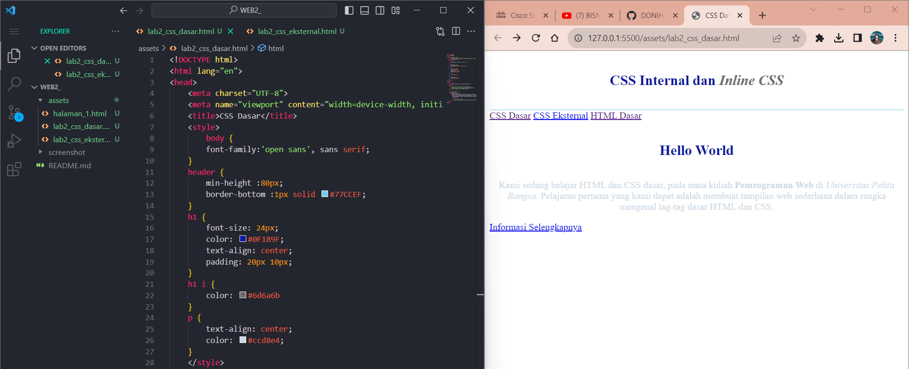
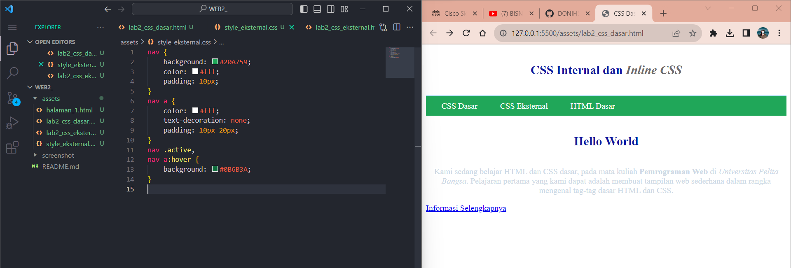
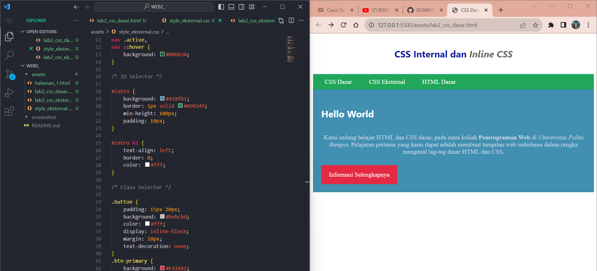
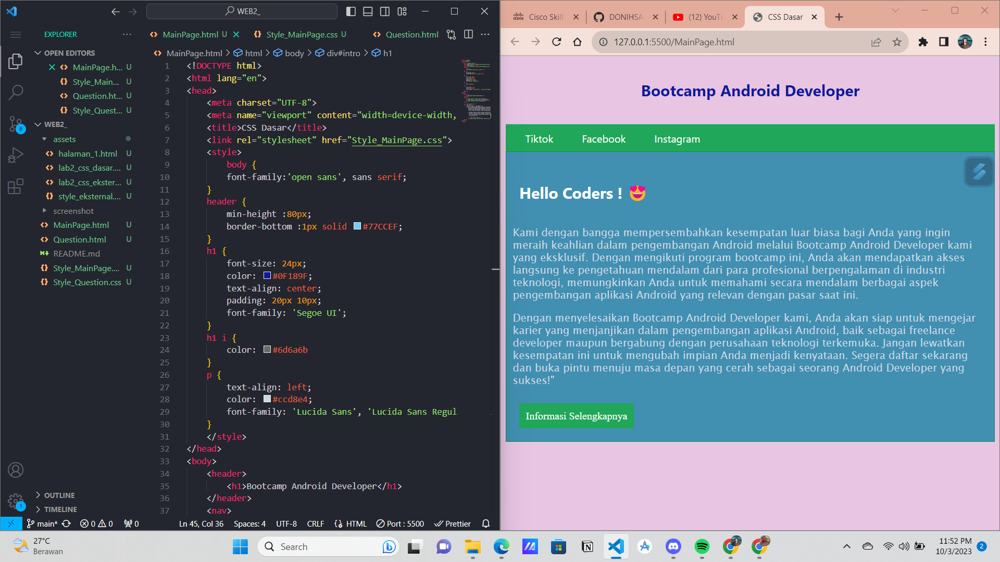
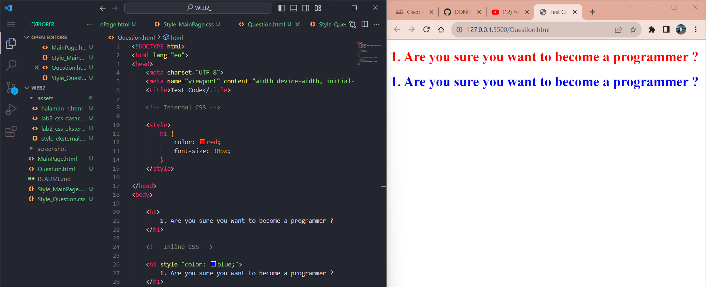
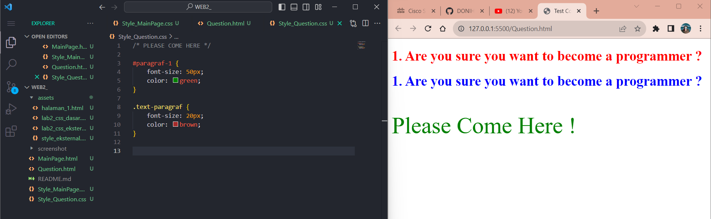
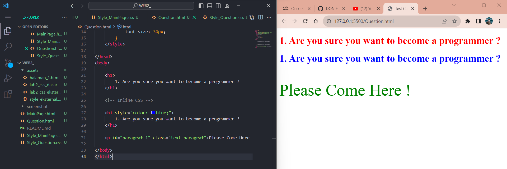

# Tugas Praktikum { Pertemuan ke 3 } 

|**Nama**|**NIM**|**Kelas**|**Matkul**|
|----|---|-----|------|
|Muhammad Ikhsan Fakhrudin|312210019|TI.22.A.2|Pemrograman WEB|

# CSS Dasar

## Langkah-Langkah Praktikum

## 1. Membuat Dokumen HTML

## 2. Mendeklarasikan CSS Internal

## 3. Menambahkan Inline CSS

## 4. Membuat CSS Eksternal

## 5. Menambahkan CSS Selector

## Pertanyaan dan Tugas

1. Lakukan eksperimen dengan mengubah dan menambah properti dan nilai pada kode CSS dengan mengacu pada CSS Cheat Sheet yang diberikan pada file terpisah dari modul ini.

2. Apa perbedaan pendeklarasian CSS elemen h1 {...} dengan #intro h1 {...}? berikan penjelasannya!

3. Apabila ada deklarasi CSS secara internal, lalu ditambahkan CSS eksternal dan inline CSS pada elemen yang sama. Deklarasi manakah yang akan ditampilkan pada browser? Berikan penjelasan dan contohnya!

4. Pada sebuah elemen HTML terdapat ID dan Class, apabila masing-masing selector tersebut terdapat deklarasi CSS, maka deklarasi manakah yang akan ditampilkan pada browser? Berikan penjelasan dan contohnya! ``( 
 )``

## Jawab

### 1. Saya akan mengubah dan menambah properti dan nilai pada kode CSS, dimulai dari membuat kerangka html nya. Bisa dilihat pada file ``MainPage.html`` dan ``Style_MainPage.css``.

### 2. ``h1{}`` ***Untuk memberikan style pada semua element h1***

- ``#intro h1{}`` Awalan simbol hash (#) memungkinkan kita untuk memberi style pada id. selector id bersifat kaku dan tidak bisa digunakan kembali pada element yang lainnya. Menurut saya lebih baik gunakan selektor class untuk mendefinisikan element yang ingin diberi nilai.

### 3. Jika ketiga CSS merubah elemen yang sama maka deklarasi tersebut akan mengikuti aturan prioritas dimana prioritas CSS nya seperti ini:

- Inline CSS
- ID selector CSS
- Internal CSS

Ini adalah tampilan coding pada html testing dimana terdapat 2 kalimat yang memiliki elemen yang sama yaitu ``h1`` :

### 4. Semakin spesifik CSS tersebut maka akan semakin tinggi prioritas CSS tersebut.

Disitu bisa dilihat terdapat 2 css yang merujuk ke elemen yang sama tapi 1 merujuk dengan ***id yang birisi font 50px dan warna hijau*** sedangkan yang satu lagi merujuk dengan ***class yang berisi font 20px dan warna brown*** dan hasilnya adalah :

## SELESAI  

